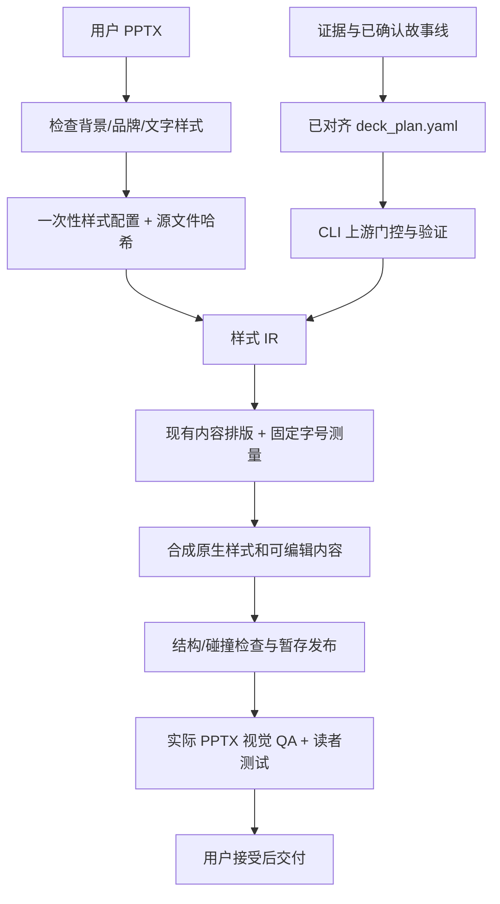

# PPTX 编译化评估与本轮落地范围

日期：2026-09-03。本轮已按用户后续澄清收窄为**样式模板**。
早期考虑的源页内容槽位绑定、示例布局克隆和密度规则不在本轮实施范围。

## PPTX 如何制作

原链路已经是确定性代码生成：`deck_plan.yaml` 保存完整页面内容，
`comh render deck` 检查 brief、故事线、大纲和细节状态后，用 python-pptx
创建空白演示文稿，按既有 page_role 函数排版，绑定证据数值、图表和备注。
旧 `theme-from-pptx` 只提取配色和字体，不导入背景、Logo 或完整母版。

因此减负重点是把**模板接入及重复适配**变成一次性配置，而非重复写排版脚本。
证据、论断、故事线和页面内容仍由 agent 与用户对齐，编译器不代替沟通判断。

## 两类模板

| 层 | 提供什么 | 本轮 |
|---|---|---|
| 样式模板 | 背景、固定 Logo/icon、品牌装饰、颜色、字体字号、粗斜体 | 实施 |
| 风格模板 | 排版密度、页面结构、图文比例、内容槽位、节奏 | 待后续讨论 |

“元素在母版里”不等于“元素是样式”。母版中的双栏内容框、原页码、示例图表
仍应排除。只提取明确指定的外观层，不由原样例推断页面组织方式。

## 借鉴 DOCX 编译器的部分

`docx_harness` 的解析、类型化 IR、验证、后端生成分离值得保留。
PPTX 本轮对应为：`inspect` 检查源文件，`profile` 校验配置并锁定哈希，
`compiler` 构建不可变 StyleDeckIR/PageStyleIR，调用现有内容 renderer，
`compose/package` 负责原生 OOXML 合成和资源关系，暂存检查成功后发布。
不修改 vendored DOCX 内部，不引入另一套不透明 writer。

这不是完整的跨媒体 DeckIR 重构：本轮 IR 只处理样式绑定，内容 renderer 仍消费
现有计划。风格/布局中间表示待范围明确后设计，避免把新术语换成旧的槽位模板。

## 减负及上下文管理

接入新模板时，agent 只需判断哪些是样式、审阅字体色板并选择典型样张。
接入后只维护页面内容和配置，不接触逐页坐标与 OOXML。
`comh context` 在 projection/deck 阶段加载所选样式摘要和当前节点需要的 surface
样式值；完整模板清单、XML 和其他页面留在磁盘，出错再局部读取。
模板变更、构建失败沿用已有失效链，不能拿旧输出冒充新版本。

减负尚未做 token/调用量对照实验，不报告百分比收益。

## 验证及限制

使用用户提供的 9 份交大模板建立可复跑工程探针，结构检查覆盖 225 个源页，
每份只取封面和正文两个样式面进行编译/预览。它们包括 16:9 和 4:3，母版装饰、
布局层装饰、普通分组图形、位图和 Office HD Photo 资源。
225 页结构清单不等于 225 页视觉验收；工程样张也不等于用户接受交付。

固定字号下发现的溢出会报错；缺失字体记录测量替代，保留 PPTX 字体声明。
原生图像背景、复杂文字效果、未保护装饰的遮挡和播放器差异仍需视觉检查。
渐变文字 token 暂不支持；探针中若选择纯色替代或显式调整字号，会单独记录。
本地使用 LibreOffice 预览，未在 Microsoft PowerPoint 中验收。

实现用法见 [样式编译指南](../../comh/instructions/references/pptx-style.md)，
样本和回归结果见 [实施验证记录](2026-09-03-pptx-style-implementation.md)。
