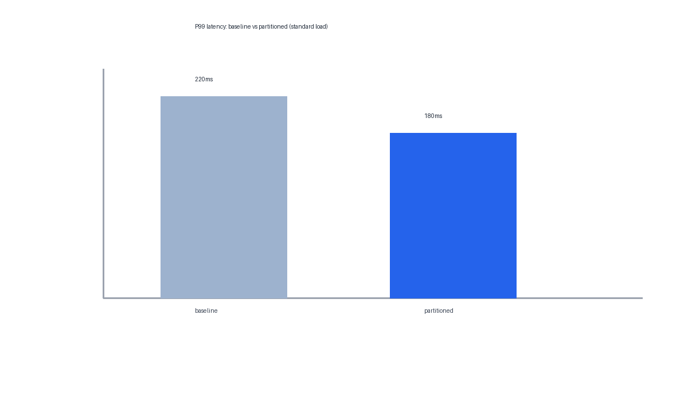
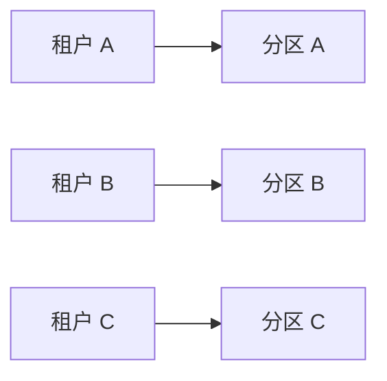

# Cache Partitioning 实验汇报

:::{document-cover}
:date: 编制日期：2026 年 9 月
:::

## 一、背景与问题

客户近期反馈的线上体验问题集中在"偶发卡顿"。从指标看，平均延迟健康，
用户感知的慢主要来自 P99 长尾请求的抖动。集群共享缓存层的命中率随热租户
行为波动，是我们定位到的主要可疑因素。本次工作验证的改动——cache
partitioning——正是针对这一机制。

## 二、实验方法

实验在 3 节点同规格存储集群上进行，缓存层容量 256GB；负载生成器按线上
真实请求分布回放流量模型 [E006]。每组配置重复运行取稳定分位：标准负载
12 轮，高负载 6 轮 [E006]。

被验证的改动：按租户哈希将共享缓存划分为独立分区，热租户的键集合无法
挤占其他租户的缓存份额，无跨区回收 [E007]。

## 三、实验结果

### 标准负载：P99 显著改善，吞吐不受影响

| 配置 | P50 (ms) | P99 (ms) | 吞吐 (QPS) |
| --- | --- | --- | --- |
| baseline | 85 | 220 [E001] | 12400 |
| partitioned | 82 | 180 [E002] | 12300 |

标准负载下，P99 latency 从 220ms 降至 180ms，降幅 18.2% [E003]；吞吐差异
（12400 → 12300 QPS）在重复轮噪声区间内，不构成回归 [E004]。逐轮时序与
轮间波动区间见附录数据（sources/results.csv）。

### 机制解释

改善与分区机制一致：租户级隔离消除了命中率随热租户行为的波动，长尾随之
收敛 [E007]。这解释了为什么收益集中在 P99 而 P50 几乎不变。

分区按租户哈希，无跨区回收；上图示意分区后的隔离结构 [E007]。

## 四、局限性

1. **高负载下改善有限。** 高负载场景中 P99 从 940ms 到 910ms，改善约 3.2% [E005]，
   远小于标准负载。
2. **瓶颈推测尚未验证。** 高负载下两配置的缓存命中率均已接近饱和，我们推测
   该场景的尾延迟瓶颈在磁盘 IO 而非缓存命中率，但这一假设**尚未单独验证**，
   属于下一阶段专项的内容 [E008]。
3. **高负载场景在客户环境的占比未知。** 灰度前建议与客户确认该场景的实际
   权重，以评估整体收益预期。

## 五、建议与下一步

1. **进入 staging 灰度**：在真实流量下验证 P99 收益与回归风险；
2. **立高负载瓶颈专项**：单独验证磁盘 IO 假设 [E008]，再决定高负载场景的
   优化路线。

两项完成后回到客户评审会同步全量决策。
